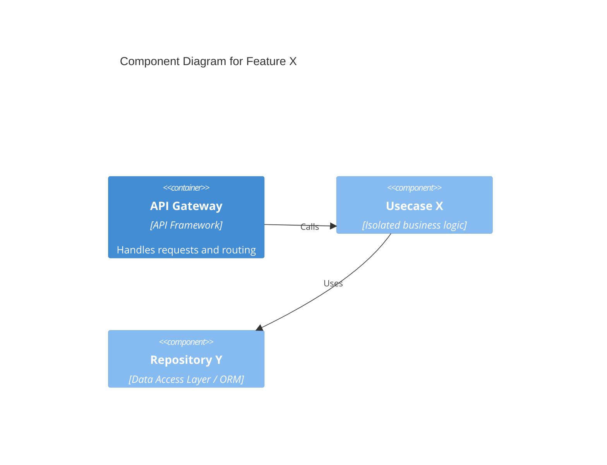

# Physical Architecture and Components (07.01_sdd_clean_architecture.md)

**Purpose:** [Describe the focus of the physical architecture that will be modeled for this issue]

---

## 1. Core Isolation (Clean Architecture)
> Describe how the core business logic (Usecases) is isolated from external systems and frameworks.

## 2. Ports and Adapters (Ports & Adapters)
> Describe the input/output ports and adapters (interfaces, APIs, DB layer abstractions) in play.

## 3. Component Topology
> Describe which physical components of the system (Controllers, Usecases, Repositories, Adapters) will be added or modified.

## 4. C4 Diagram (Container / Component)
> The use of Mermaid.js syntax is mandatory.

## 5. Boundaries and Avoided Violations
> Highlight which Clean Architecture protections were considered. (e.g., The Usecase does not depend on the Database layer).

