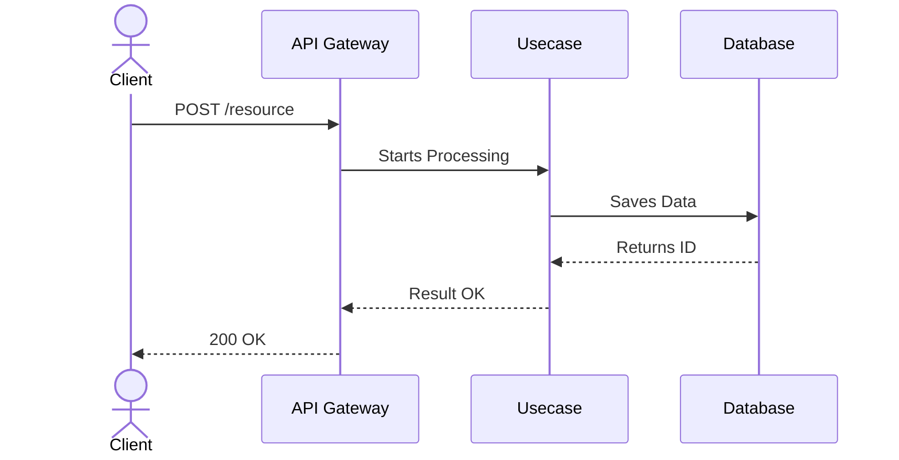

# Logical and Asynchronous Flows (08.01_edd_logic_flows.md)

**Purpose:** [Describe the specific event flows of this issue]

---

## 1. Main Sequence Flow (Synchronous)
> Mermaid diagram of the synchronous HTTP flow.



## 2. Asynchronous Flows and EDD
> Which tasks do not need to block the user's request? (Queues, Event Handler / Worker, Webhooks).

### 2.1 Event Handler / Worker
- **Trigger:** Event `system/resource.created`
- **Action:** Sends confirmation email.
- **Diagram (Optional):**
  ```mermaid
  sequenceDiagram
      participant Core
      participant EventHandler
      participant EmailProvider
      
      Core->>EventHandler: Emits Event
      EventHandler->>EmailProvider: Sends Email
  ```

## 3. Messaging Strategy
> Describe the message brokers, channels, queues, or topics used in asynchronous processing.

## 4. Resilience and Idempotency
> Define handling for at-least-once message delivery, idempotency control in consumers, retry loops, and Dead Letter Queues (DLQ).
- **Idempotency Strategy:** [How consumers prevent duplicate processing]
- **DLQ / Retries:** [Failure management and retry backoffs]

## 5. Event Serialization and Contracts
> Specify transmission formats (e.g., Avro, Protobuf, JSON) and contract versioning to avoid breakages.
- **Format:** [JSON/Avro/etc.]
- **Versioning:** [How schema changes are handled]

## 6. Caching Strategy
> How and where will Cache Strategy be used? Invalidation Rules.
- **Key:** `resource:id`
- **TTL (Time to Live):** 10 minutes.
- **Invalidation Rule:** When there is a PUT/DELETE on the resource.

## 7. Traceability and Correlation IDs
> Describe how distributed tracing is implemented in asynchronous flows and how Correlation IDs are propagated between microservices/workers for auditing and debugging.
- **Correlation ID Injection:** [Where is it generated and injected]
- **Propagation:** [How it is passed through message brokers and downstream services]

## 8. Payload Security
> How sensitive data is handled in asynchronous messages (e.g., in-transit encryption, PII obfuscation/masking in payloads).
- **Protection Strategy:** [Describe how sensitive data is secured within events]

