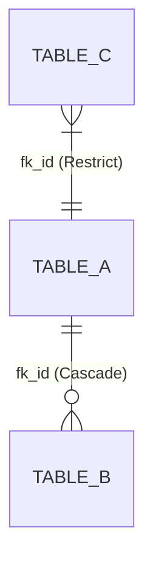

# Data Schema (09_schema.md)

**Purpose:** [Describe the intended database changes for this issue]

---

## 1. New Tables / Modifications
> List the tables that will be created or changed.

### Table: `table_name`
- **Description:** Purpose of the table.
- **Columns:**
  - `id`: Primary Key / ID
  - `example_field`: varchar(255) (Not Null)
  - `created_at`: timestamp (Default now)

## 2. Relationships (Foreign Keys)
> How do the tables connect? Using Mermaid syntax (`erDiagram`) is mandatory.

## 3. Indexes (Performance & Concurrency)
> WHICH indexes will be necessary to ensure performance under high load?
- **Index 1:** (Columns: `[example_field]`) - Reason: Frequent searches by this field.

## 4. Data Engineer Validation
> **[DATA_ENGINEER Exclusive Area]**
> Validation opinion on structural design, concurrency (e.g., use of safe concurrency) and any index adjustments.
- [ ] Schema approved and optimized.
- Additional comments: ...
