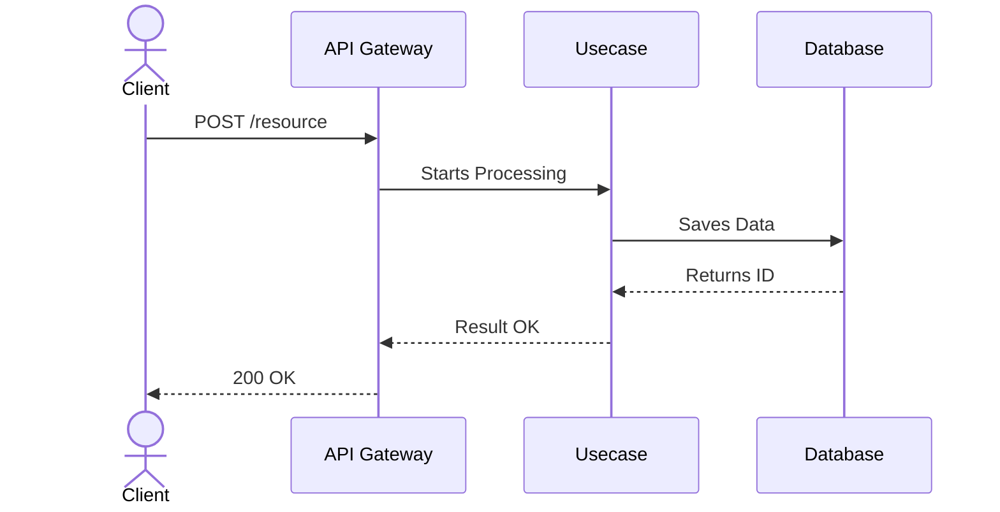

# Logical and Asynchronous Flows (12_logic_flows.md)

**Purpose:** [Describe the specific event flows of this issue]

---

## 1. Main Sequence Flow (Synchronous)
> Mermaid diagram of the synchronous HTTP flow.



## 2. Asynchronous Flows and EDD
> Which tasks do not need to block the user's request? (Queues, Event Handler / Worker, Webhooks).

### 2.1 Event Handler / Worker
- **Trigger:** Event `system/resource.created`
- **Action:** Sends confirmation email.
- **Diagram (Optional):**
  ```mermaid
  sequenceDiagram
      participant Core
      participant EventHandler
      participant EmailProvider
      
      Core->>EventHandler: Emits Event
      EventHandler->>EmailProvider: Sends Email
  ```

## 3. Caching Strategy
> How and where will Cache Strategy be used? Invalidation Rules.
- **Key:** `resource:id`
- **TTL (Time to Live):** 10 minutes.
- **Invalidation Rule:** When there is a PUT/DELETE on the resource.
