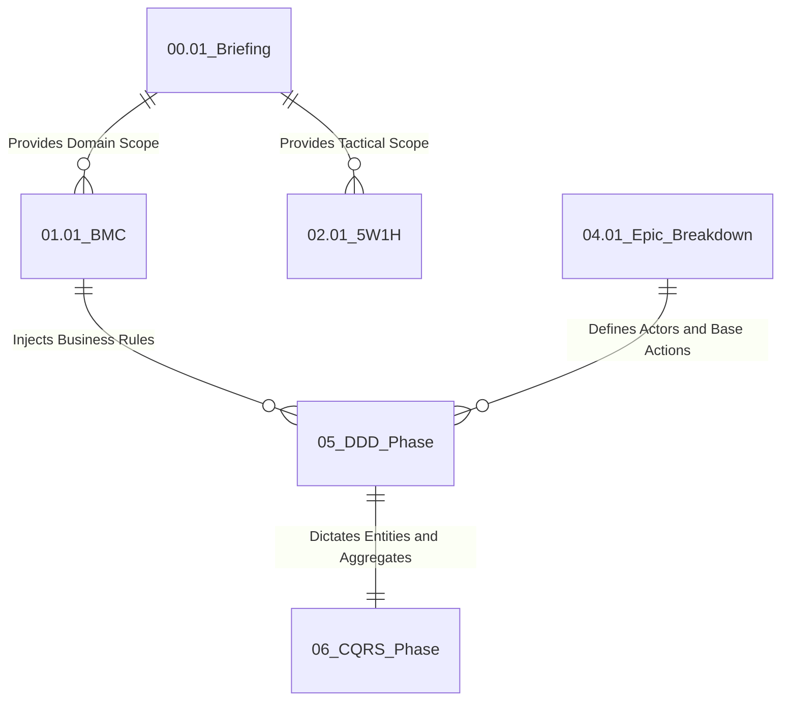

# Data Schema (06.01_cqrs_schema.md)

**Purpose:** Define the project's data schema and evaluate the adoption of the CQRS pattern based on the volumetry of I/O operations.

---

## 1. Pattern Evaluation (CQRS)
> Is there an imbalance of read/write or a need for eventual consistency?
- **Imbalance (Read vs Write):** **None (N/A).** The Skill's operations flow is strictly cadenced, executing validations and unit writes (one file at a time) serially. Since the architecture operates purely on the developer's local machine File System, the I/O consumption ratio does not present bottlenecks or aggressive overlaps, making the adoption of a segregated CQRS model completely unnecessary (characterizing overengineering).
- **Eventual Consistency:** **Not applicable (Strong Consistency).** The local architecture guarantees *Strong Consistency*. Writes are synchronous; the saved data is immediately available for the next read. Furthermore, the tool relies on native transactional security anchored in the sentinel file `00.00_tracking_changelog.md`, which not only ensures the synchronous state of the interview but also enables a structural "Rollback": if the cycle is interrupted, it's possible to resume the session with millimeter precision from the last recorded checkpoint.

## 2. New Tables / Modifications
> List the tables/structures that will be created or altered.
- **Traditional Tables (SQL/NoSQL):** **None.** The architecture does not use classic DBMS.
- **Central Control Table (Transactional State):** The only living and mutable data structure of the system is the embedded `YAML` tree in the sentinel file `00.00_tracking_changelog.md`. It acts as the master "database" for flow control and application checkpoints.
- **Read Records (Raw Data):** The plain text artifacts (`.md`) that are iteratively generated by the LLM agent in the destination folder act as the consolidated data records of the system.

## 3. Relationships (Knowledge Dependency)
> How do the structures connect?
Since the architecture does not use DBMS tables, there are no classic Foreign Keys. Replacing the relational ER model, the project's data relationships represent the **Knowledge Dependency Relations** between the files, as required by the scripts in the `phases/` folder.

A later artifact consumes (does a "semantic JOIN" on) the knowledge that has already been consolidated in previous files to be formulated.

## 4. Indexes (Performance & Concurrency)
> Which indexes/keys will be necessary to guarantee performance?
- **Pass-Through (N/A):** The local architecture does not use conventional indexing (e.g., B-tree). The mitigation of performance bottlenecks and the prevention of LLM memory overflow (Window Token Limit) are natively guaranteed by the **modular segmentation of files**. By fractioning the methodologies into dozens of isolated Markdown documents, the Skill injects into the Engine only the strictly necessary context for each phase, optimizing processing without the need for external indexers.

## 5. Data Engineer Validation
> Final opinion on the structural design.
- [x] Schema and data architecture approved.
- **Additional Comments:** The adoption of a model based on the File System coupled with semantic fragmentation proved to be a highly cohesive and armored decision to bypass the native I/O and token limitations of the local AI Agent.
