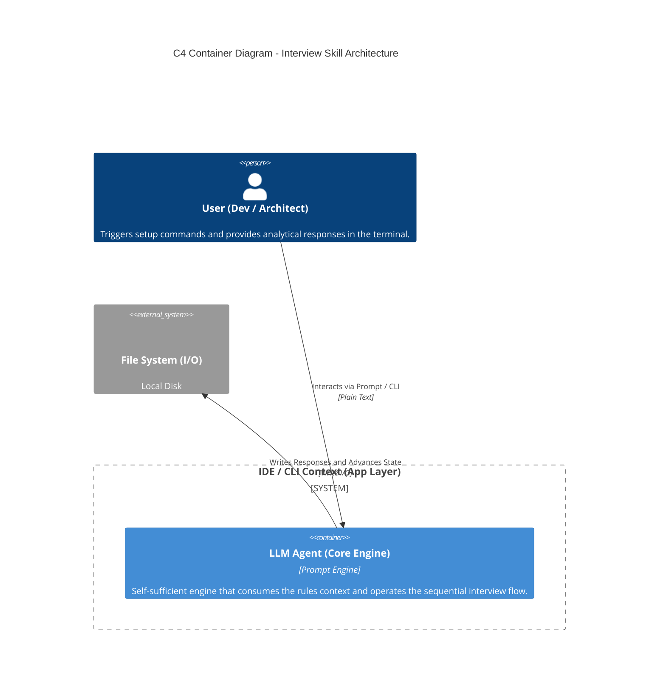

# Physical Architecture and Components (07.01_sdd_clean_architecture.md)

**Purpose:** Model the physical boundaries of the project, ensuring the independence of Business Rules regarding I/O (File System/CLI).

---

## 1. Core Isolation (Clean Architecture)
> How is our Core Logic (Use Cases) physically isolated from external frameworks and the File System?
- **Absolute Isolation:** Our Business Logic (composed of the Methodological Scripts in Markdown) operates in a purely semantic vacuum. It has no awareness of the existence of the operating system (Windows), the Terminal, or the File System. All the "dirt" of physical persistence (reading and writing to disk) and UI rendering is delegated strictly to the outermost layer of the system (the LLM Agent and the CLI runner). This ensures the sacred pillar of Clean Architecture: independence from I/O frameworks.

## 2. Ports and Adapters
> What interfaces (Ports) does our LLM/CLI require, and how do we implement them (Adapters)?
- **Pass-Through (N/A):** The Skill's architecture does not implement the Hexagonal Architecture pattern (Ports & Adapters). Since the solution does not consume external APIs, has no distributed databases, or multiple UI interfaces that require interchangeable abstractions, mapping "Ports and Adapters" would constitute severe overengineering. The tool operates self-sufficiently and hardcoded over the local File System I/O and the unified CLI.

## 3. Component Topology
> Description of the physical components at play.
- **Pass-Through (N/A):** The local architecture dispenses with the formal lotting into isolated physical and logical sub-components (such as Controllers, Routers, or Services). The operational ecosystem is inherently atomic, where execution occurs holistically within the unified LLM engine processing plain text directories (Markdown), which invalidates any effort of complex physical topology.

## 4. C4 Diagram (Container / Component)
> Visual map (Mermaid) of the architectural connections and system boundaries.
Below is the structural representation of **Level 2 (C4 Container Diagram)**. The diagram highlights the isolation of Business Logic and the restricted flow of I/O in the local architecture:

## 5. Protections and Avoided Violations
> How do we ensure that a technical detail (e.g., Markdown Parsing) doesn't break or contaminate our Interview business rules?
The main threat in the Generative AI domain is not "Database contamination", but rather **Hallucination (Context Drift) and LLM Agent Behavioral Indiscipline**. To shield the project against this vital violation, a "Fortress of Guardrails" was architected:

**1. Scope Deviation and Structural Hallucination (Context Drift)**
- **Defense Mechanism:** The heavy implementation of Guardrails via the `Templates/` folder (locking the visual structure and the exact topics to be answered) and the atomic scripts in the `phases/` folder (which inject context on demand). This boundary ensures that the AI walks exclusively on the tracks designed by the Architect, preventing methodological distortion.

**2. Role Contamination and Undisciplined Execution**
- **Defense Mechanism:** The sentinel file `Skill.md` establishes a high-level behavioral lock. It forces the LLM engine to strictly adopt the personas of *Software Architect* and *Product Manager*. Systemic protections block out-of-scope attitudes (e.g., "Do not generate executable code") and force vital attitudes ("Challenge shallow answers").

**3. Visual Chaos and Rendering Contract Breach**
- **Defense Mechanism:** The `reference/` folder acts as an inviolable viewing contract (Markdown Guidelines). The Core imposes a strict color taxonomy (Yellow for Architecture, Blue for Paths) and H2/H3 header formatting, ensuring that the LLM's raw Output is rendered predictably, legibly, and standardized by the CLI.
