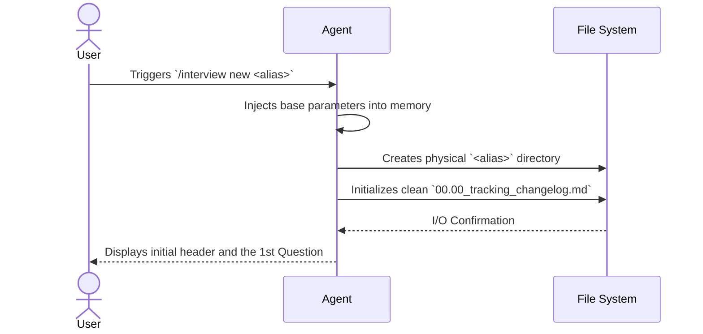
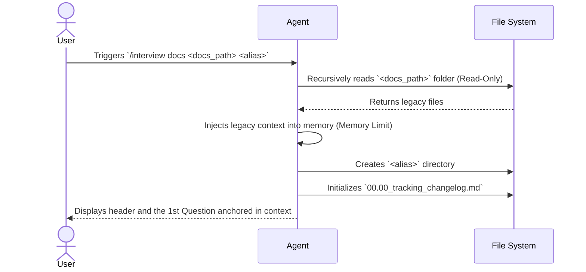
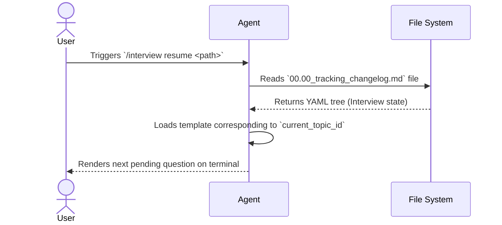
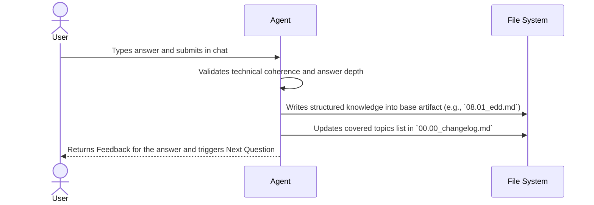
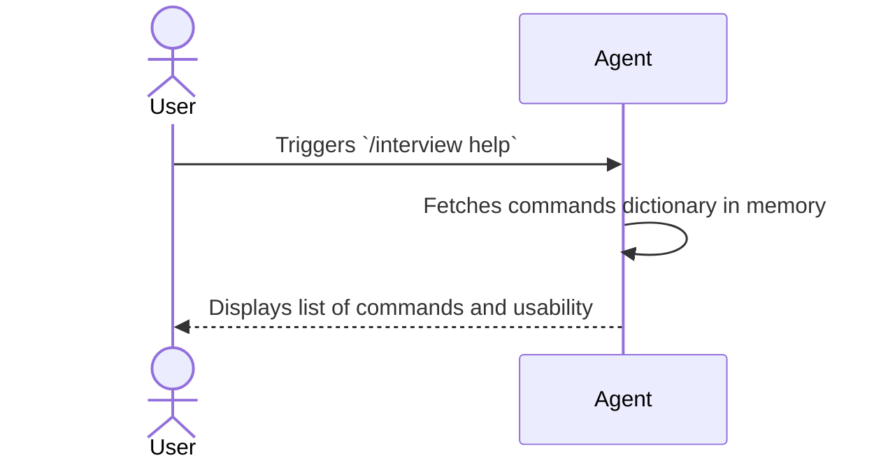
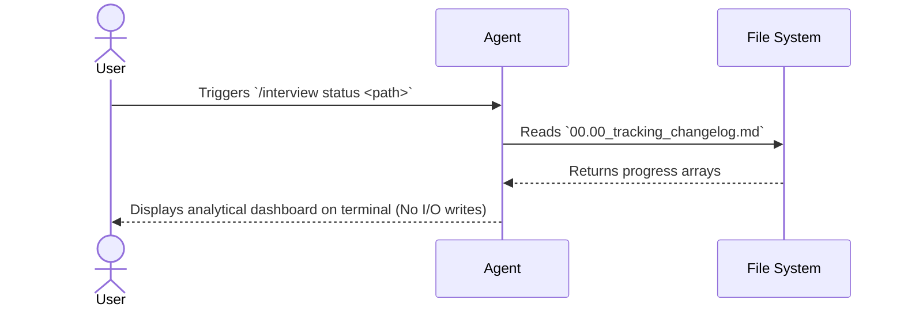
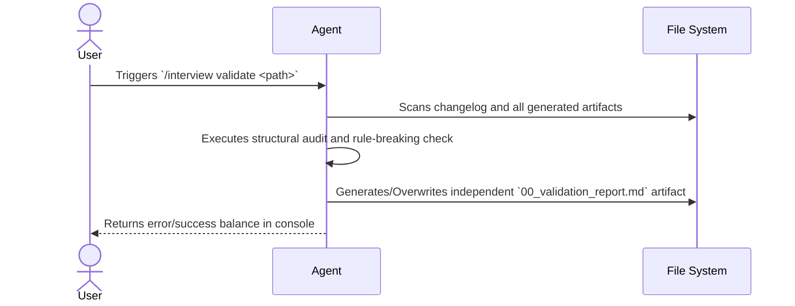

# Logic Flows and Events (08.01_edd_logic_flows.md)

**Purpose:** Map the "Nervous System" of the application, defining the primary synchronous chain and how the system reacts asynchronously to domain events so as not to degrade the experience.

---

## 1. Main Sequence Flow (Synchronous)
> Mermaid diagram of the main flow (Happy Path).

The CLI architecture has a strictly synchronous and atomic ecosystem. To cover the entire I/O surface, we mapped individually the calls to interface commands and the base cycle of human interaction:

### 1.1 Command `/interview new <alias>`

### 1.2 Command `/interview docs <docs_path> <alias>`

### 1.3 Command `/interview resume <path>`

### 1.4 Standard Interaction (Answer Submission in Chat)

### 1.5 Command `/interview help`

### 1.6 Command `/interview status <path>`

### 1.7 Command `/interview validate <path>`

## 2. Asynchronous Flows and EDD (Event-Driven)
> Which actions are triggered by events (in background) so as not to lock the user's main flow?
- **Pass-Through (N/A) - Purely Synchronous Architecture:** Honoring the architectural definitions of determinism, the tool has no background processes or concurrent executions (Parallel threads). The entire execution and processing flow is strictly linear and blocking. Since File System writing operates on the order of milliseconds, introducing asynchronous events would not bring performance gains and would only add unjustifiable complexity to the engine.

## 3. Messaging Strategy
> What is the adopted messaging infrastructure / routing?
- **Pass-Through (N/A):** Due to the intrinsically local, synchronous, and atomic nature of the application, the adoption of message buses (Message Brokers like Kafka, RabbitMQ, or SQS) is dispensed with. CLI commands are ingested and routed directly in RAM memory by the LLM engine to the File System, removing messaging overhead from the architecture.

## 4. Caching Strategy
> How and where do we use Cache strategies? Invalidation rules.
- **Pass-Through (N/A):** The ecosystem is stripped of any dedicated in-memory Caching mechanism (like Redis or Memcached). With each interaction, the machine restores state by actively re-reading the File System (`00.00_tracking_changelog.md`) from absolute zero. Rather than an architectural flaw, this absence of cache is a vital feature: it forces an "absolute determinism" where the static file on the HDD is the only possible source of truth, nipping in the bud the classic risk of phantom state or cache desynchronization.
